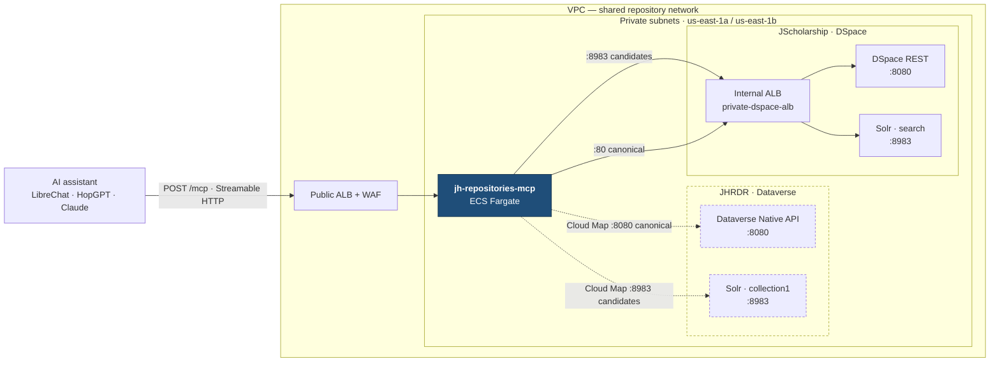

# jh-repositories-mcp

A read-only [Model Context Protocol](https://modelcontextprotocol.io) server that
gives AI research assistants one federated search interface over two independently
operated Johns Hopkins repositories:

- **JScholarship** — the institutional repository (theses, articles, reports), on
  DSpace, indexed by a SolrCloud `search` collection and resolved through DSpace REST.
- **JHRDR** — the Johns Hopkins Research Data Repository (datasets), on Dataverse,
  indexed by Solr `collection1` and resolved through the Dataverse Native API.

Different platforms, different metadata models, different notions of "published."
A researcher asking *"what has Hopkins published on X, and is there data I can
reuse?"* shouldn't have to know any of that.

Strict TypeScript on [Bun](https://bun.sh), with [Hono](https://hono.dev) and the
MCP TypeScript SDK's Web Standard Streamable HTTP transport, deployed as ECS
Fargate tasks.

## New here?

This repo ships its own onboarding guide as a Claude Code skill:
[`.claude/skills/jh-repo-mcp-onboarding/`](.claude/skills/jh-repo-mcp-onboarding/SKILL.md).
Open the repo in Claude Code and ask for a walkthrough — you'll get a staged tour
that starts by verifying your toolchain, teaches the invariants in the order they
build on each other, and stops to check that each one landed. It also works as an
architecture reference, and as a pattern guide if you're building another MCP
server on the same bones.

Prefer to read? Start with [`CLAUDE.md`](CLAUDE.md) for current state and
conventions, [`CONTEXT.md`](CONTEXT.md) for the domain vocabulary, then
[ADR-005](docs/adr/ADR-005-solr-candidates-canonical-api-gate.md) for the decision
everything else follows from.

## The one idea

> **Solr finds candidates. The canonical API decides truth.**

Every search hits a private Solr collection for fast candidate retrieval — but
nothing Solr returns is trusted. Each candidate is re-fetched through the
platform's own public API as an anonymous caller, and any candidate that fails
that fetch is silently dropped. No Solr-sourced metadata ever reaches a client.

The Solr indexes are internal, they lag the platforms, and their copies of
access-control fields have drifted from what the platforms actually enforce.
Treating the index as the authority means eventually publishing a withdrawn
thesis. So the whole architecture is built around one guarantee: **never disclose
a record that isn't public, and never let a client infer that one exists.**
Most of what looks over-engineered here is downstream of that.

## Topology

Everything runs in one VPC. The MCP tasks attach ENIs to the same private subnets
as both repository deployments, so there's a direct network path to each with no
NAT and no peering, and east-west traffic stays on plain HTTP.



Two hops per repository, and the split is the architecture: the **Solr** edge
finds candidates, the **canonical API** edge decides which of them are real and
public. DSpace is reached through an internal ALB that fronts both its REST API
and its Solr collection; Dataverse is reached directly through Cloud Map service
discovery.

The dashed JHRDR path is documented but not yet validated against live
infrastructure — see [`docs/spike/endpoint-routes.md`](docs/spike/endpoint-routes.md)
for DNS names, ports, health paths, security group rules, and the open questions
on the Dataverse side.

## MCP surface

Closed and fixed for v1 — no dynamic registration, strict schemas throughout.

| Type | Name | Purpose |
| --- | --- | --- |
| Tool | `search_items` | Federated search with filters and cursor pagination |
| Tool | `get_item` | Resolve a single record through its canonical API |
| Tool | `list_facets` | Approved common and repository-qualified facets |
| Tool | `find_related_items` | Related-record discovery |
| Tool | `explain_search` | How a query was interpreted, no backend syntax leaked |
| Resource | `jhu-repo://jscholarship/item/{id}` | A canonical JScholarship record |
| Resource | `jhu-repo://jhrdr/dataset/{id}` | A canonical JHRDR dataset |
| Prompt | `explore_research_topic` | Guided cross-repository search |
| Prompt | `find_reusable_data` | Guided dataset discovery |

v1 is deliberately narrow: anonymous, read-only, no embedded LLM, no vector
search, no writes, no file-content proxying. Adding to this list is a spec change,
not a feature PR.

## Quick start

```bash
bun install --frozen-lockfile   # honors .bun-version and the committed bun.lock
bun run typecheck               # tsc --noEmit — the bundler does not type-check
bun test                        # unit, property, contract, integration
bun run lint                    # biome check .
```

Then start it. Config validation is fail-fast, so `bun run dev` with no
environment will exit and list everything it needs at once:

```bash
ENVIRONMENT=stage BUILD_VERSION=dev BUILD_COMMIT=local \
JSCHOLARSHIP_SOLR_URL=http://localhost:8983/solr/search \
JSCHOLARSHIP_API_URL=http://localhost:8080/server/api \
JSCHOLARSHIP_PUBLIC_URL=https://jscholarship.library.jhu.edu \
ALLOWED_HOSTS=localhost \
bun run dev
```

`GET /health/live` reports process liveness. `GET /health/ready` stays 503 until
Solr schema validation passes — a task that can't confirm the index still has the
fields its profile depends on never takes traffic. The JHRDR adapter is only
constructed when all three of its URLs are set, so leaving them unset runs the
service single-repository. Full variable list and defaults are in
[`src/config/env.ts`](src/config/env.ts).

## Layout

```
src/
  index.ts        Hono app, health routes, adapter wiring, startup schema validation
  mcp/            Transport, the closed tool/resource/prompt registry, tool handlers
  adapters/       The RepositoryAdapter seam, safe Solr query layer, canonical gate,
                  caching and retry, and one directory per platform
  federation/     Reciprocal-rank merge, opaque cursors, response assembly
  models/         Domain types, zod schemas, namespaced identifiers
  security/       Host and Origin validation, edge and deadline middleware, semaphore
  observability/  Allowlist-redacted logging, CloudWatch EMF metrics
config/repositories/   Repository profiles: field allowlists and immutable public filters
test/           unit, property, contract, integration, fixtures
infra/          OpenTofu — shared stack and per-environment service
```

[`src/adapters/index.ts`](src/adapters/index.ts) is the architectural seam.
Nothing above it — federation, tools, registry, transport — knows that Solr,
DSpace, or Dataverse exist.

## Documentation

| Where | What it's for |
| --- | --- |
| [`CLAUDE.md`](CLAUDE.md) | Current state, invariants, commands, conventions. Start here. |
| [`CONTEXT.md`](CONTEXT.md) | Domain vocabulary — the terms to use, and the ones to avoid |
| [`docs/adr/`](docs/adr/README.md) | Twelve accepted ADRs: why each structural decision was made |
| [`docs/spike/`](docs/spike/) | Verified facts about the deployed Solr schemas and network routes |
| [`.kiro/specs/jscholarship-jhrdr-mcp/`](.kiro/specs/jscholarship-jhrdr-mcp/) | Requirements, design, and the dependency-ordered task plan |
| [`.kiro/steering/`](.kiro/steering/) | Team standards: TypeScript, error handling, logging, security, testing |
| [`.claude/skills/jh-repo-mcp-onboarding/`](.claude/skills/jh-repo-mcp-onboarding/SKILL.md) | The onboarding walkthrough and architecture reference |
| [`CONTRIBUTING.md`](CONTRIBUTING.md) | How to make a change here: tests, fixtures, scope, commits, PRs |
| [`AGENTS.md`](AGENTS.md) | Repository guidelines for coding agents |
| [`test/fixtures/*/README.md`](test/fixtures/) | Fixture provenance and sanitization rules |

Source comments cite requirement numbers (`_Requirements: 2.4-2.6_`) that resolve
into the Kiro spec. **Where a document and the source disagree, the source wins** —
say so, and fix the document.

## Contributing

See [`CONTRIBUTING.md`](CONTRIBUTING.md) for the full guide — the invariants to
check before changing behavior, what belongs in which test directory, fixture
sanitization, changelog fragments, and commit and PR conventions.

The short version: add tests with each behavior change, put invariants in
`test/property/` as generated cases, describe the change with a `changelog.d/`
fragment, and cite the requirement and task numbers your PR advances. Never commit
credentials, private endpoints, or unreviewed repository payloads.

## Deployment

Multi-stage [`Dockerfile`](Dockerfile) on Bun, running non-root. Infrastructure is
OpenTofu in [`infra/`](infra/) — a shared stack (IAM, ALB, WAF) plus a per-environment
service, one MCP service per environment. CI in
[`.github/workflows/`](.github/workflows/) runs lint, typecheck, test, build, and a
dependency audit, with separate build-push, deploy, infra-validate, and smoke-test
workflows.

Post-deployment verification:

```bash
./scripts/smoke-test.sh https://mcp-stage.library.jhu.edu
```

## Status

Tasks 1–19 and 22–24 in [`tasks.md`](.kiro/specs/jscholarship-jhrdr-mcp/tasks.md)
are complete: the service is implemented, tested, containerized, and deployed to
stage. Open work is task 20 (OpenTofu stack), 21 (public edge), 25 (pilot
evaluation), and 26 (production release).

## License

[Eclipse Public License 2.0](LICENSE).
